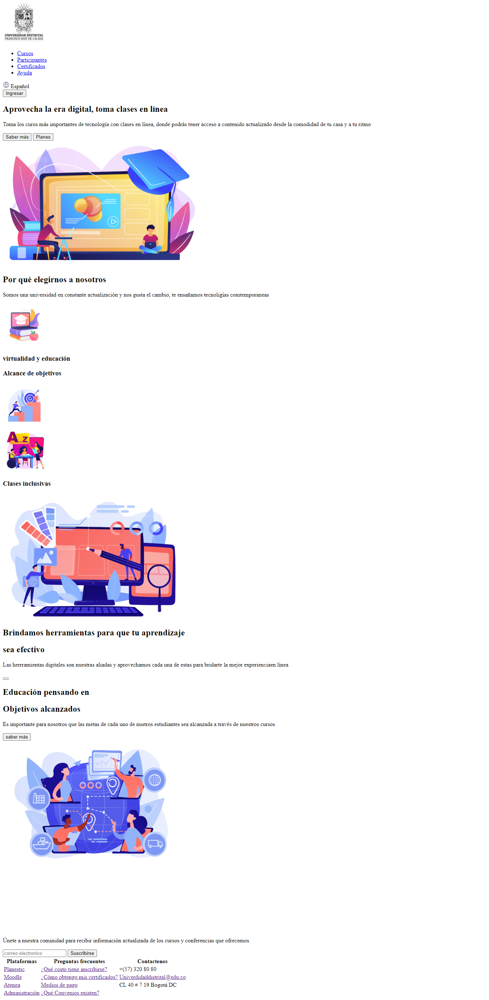
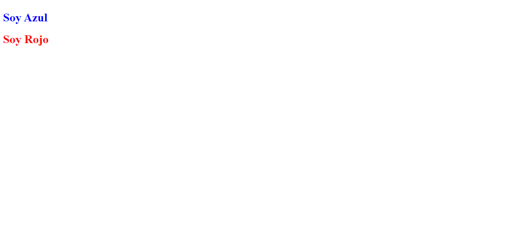
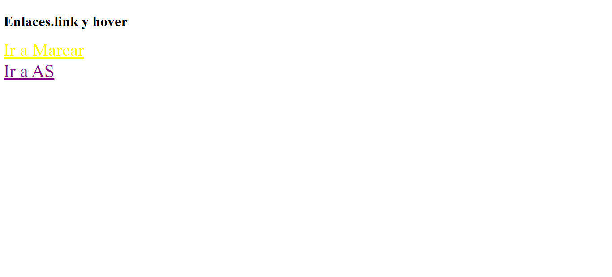
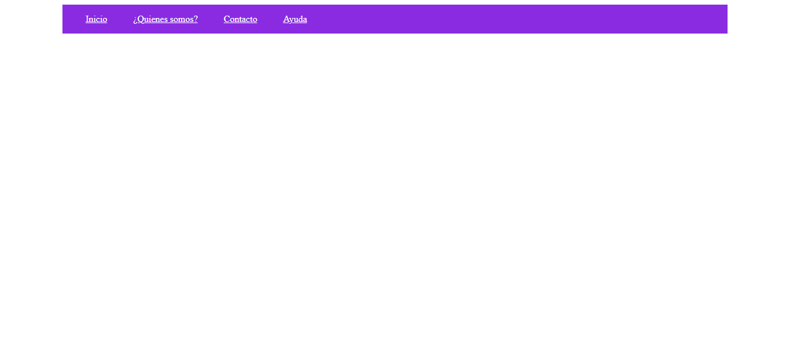
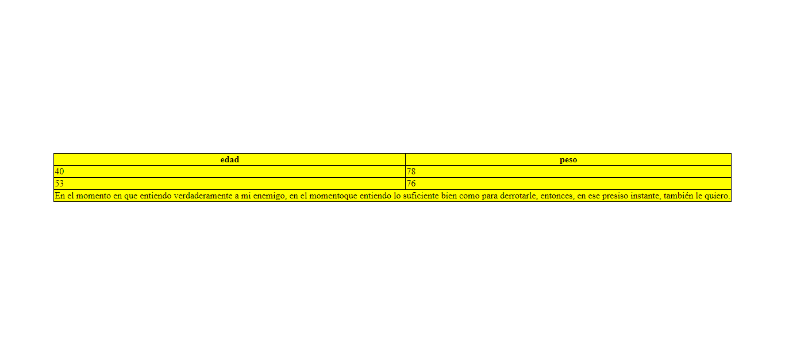

<h1>Taller Manuel Esteban Garzon Camargo</h1>

<h2> Información</h2>

Curso: full Stack Basico - Grupo 1

Profesor: Cristian Patiño

<h3>link página Web</h3>
<a href="https://mangarca.github.io/Taller-9-full-stack/" target="_blank">Link página web</a>

<h2> Punto 1: Link figma</h2>

<a href="https://www.figma.com/file/i8EsmGQiSEXKgyJVPS4je7/Manuel-Esteban-Garz%C3%B3n-Camargo?type=design&node-id=18%3A681&mode=design&t=kxIsViUpJM0xnttX-1" target="_blank">Link de Figma</a>

<h2> Punto 2: HTML</h2> 

<h2> Punto 3: CSS</2>

<h2>Punto 4: Titulos</2>

<h2>Punto 5: Estilos de texto</2>

<h2>Punto 6: Enlaces</h2>

<h2>Punto 7-8: Navegación</h2>

<h2>Punto 9: Tablas</2>

